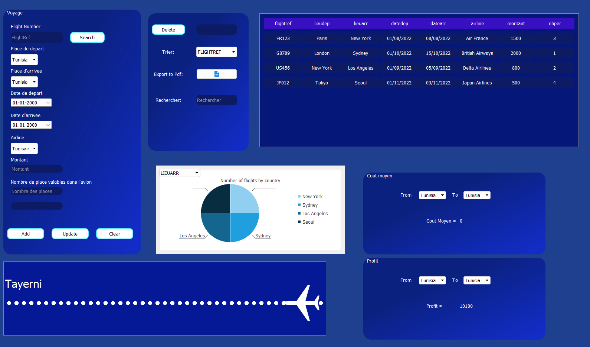

# Interface Gestion de Voyages

Welcome to the Interface Gestion de Voyages project! This is a Qt C++ application that provides an interface for managing travel data. The main functionality is implemented in the `mainwindow.cpp` file.

## Table of Contents

- [Features](#features)
- [Getting Started](#getting-started)
    - [Dependencies](#dependencies)
    - [Installation](#installation)
    - [Usage](#usage)
- [Contributing](#contributing)
- [License](#license)

## Features

- Search for travel data by date, airline, amount, and number of people
- Sort travel data by various criteria
- Calculate the average cost of travel between two locations
- Display the total profit earned from all travel bookings
- Read RFID card data and display the corresponding traveler information
- Display a graphical animation of a plane flying across the screen

## Getting Started

### Dependencies

This project requires the following dependencies:

- Qt 5.15.2 or later
- QtCharts
- QtGraphics
- QtTimer
- QtArdiuno
- QtSqlDatabase

### Installation

To install this project, follow these steps:

1. Clone the repository: `git clone https://github.com/your-username/interface-gestion-de-voyages-Qt-Cpp.git`
2. Open the `mainwindow.cpp` file in Qt Creator
3. Build and run the project

### Usage

To use this application, simply run the executable file. The interface will be displayed, and you can use the various buttons and fields to interact with the travel data.

## Contributing

We welcome contributions from everyone! If you find a bug or have a feature request, please open an issue on GitHub. If you would like to contribute code, please follow these steps:

1. Fork the repository by clicking the "Fork" button on GitHub
2. Clone your forked repository to your local machine
3. Create a new branch for your changes: `git checkout -b my-new-feature`
4. Make your changes and commit them: `git commit -am 'Add some feature'`
5. Push your changes to your forked repository: `git push origin my-new-feature`
6. Create a pull request by clicking the "New pull request" button on GitHub

Before submitting a pull request, please make sure that your code adheres to the project's coding standards and that all tests pass. We also recommend that you discuss your proposed changes with the project maintainers beforehand to ensure that they align with the project's goals and direction.

For more information on how to contribute to this project, please see our [contributing guidelines](./CONTRIBUTING.md).

## License

This project is licensed under the MIT License. See the `LICENSE` file for more information.
